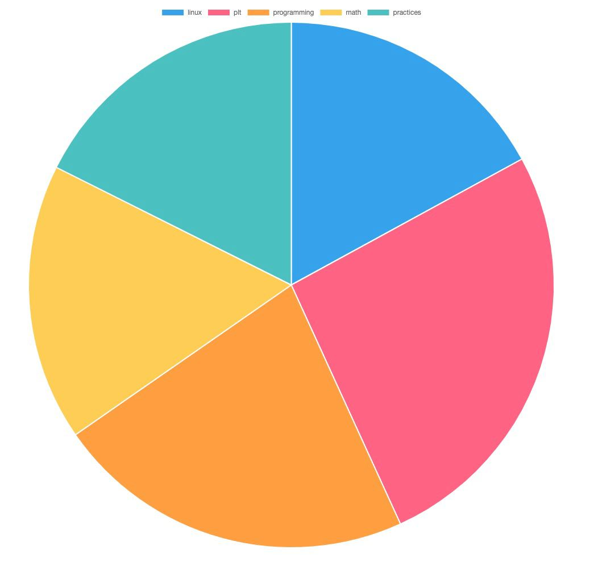

# Web Scraping

- Scraping data from the web : categories and updvotes from every article.
- Creating a database with the scraped data
- displaying the most upvoted categories in a chart

## Techstack

- React
- ChartJS
- Supabase
- NodeJS
- Puppeteer

